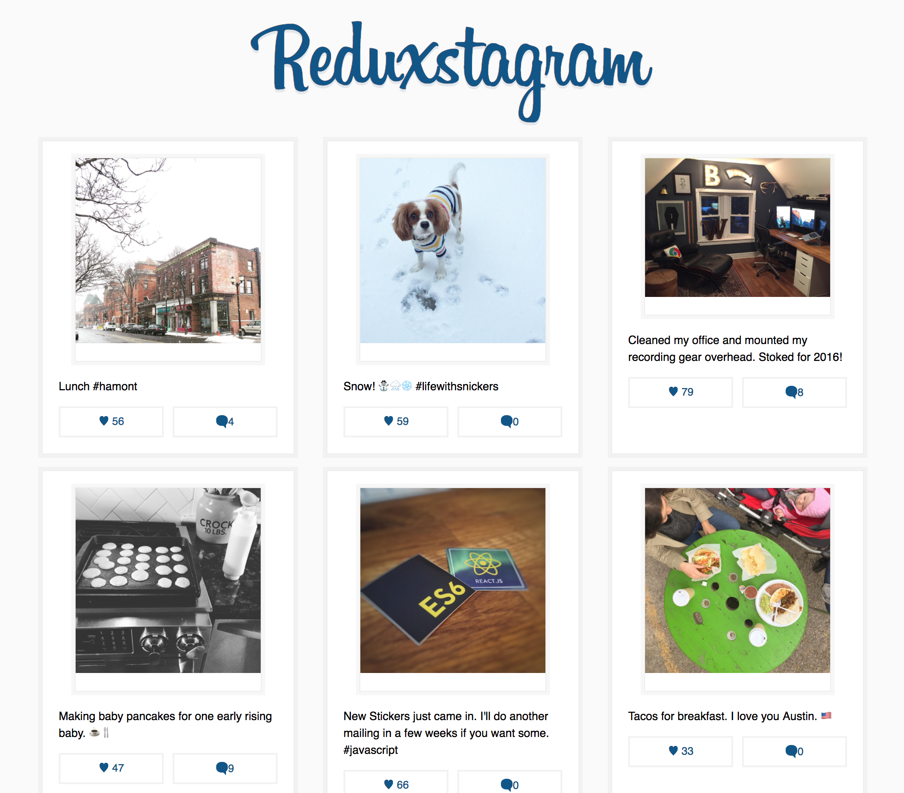
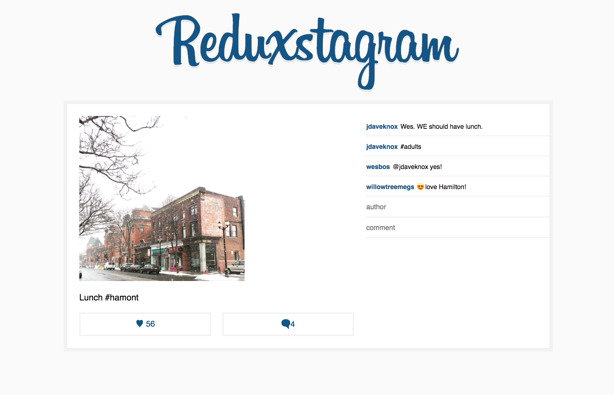

# React Redux Photo App

A 'Instagram clone' with React + Redux implementation.
Addition 1

## Running

First `npm install` to grab all the necessary dependencies. 

Then run `npm start` and open <localhost:7770> in your browser.

## Production Build

Run `npm build` to create a distro folder and a bundle.js file.

---
---

